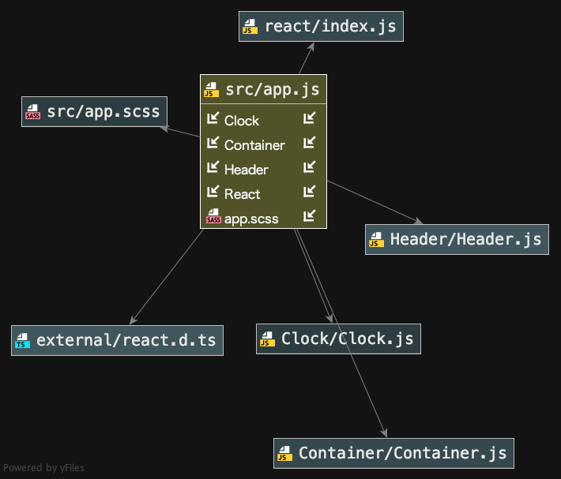

# list-taker

### Author:  Alistair Blake 
#### Link and Resources
*[Repo] (https://github.com/Alwynblake/list-taker)

#### User Stories
1.	As a developer of this app, I want ot allow to end-user to utilize a 
simple task-management tool.

#### About list-taker
This is a simple app using ReactJS. 
It returns a hierarchy of views in JSX to display via the render() method.
Essentially capturing data in responds to user inputs.

#### Feature Tasks
Created the following components and structured them according to the following diagram.
``` 
Index
  App
    Clock
    Header
    Container
```
###### App Component
* The App component is the entry point.

###### Header Component

###### Clock Component

###### Container Component
* The Container component manages the entire **application state**
* The state contains a list array
* It has a `list.push(note)` method that adds a note to `state.list`
  * every note that gets added has the following data
    * `id`: should always contain a result of `Math.random`
    * `note`: user provided content
    
#### Tests
    * To run tests, please use the `npm run test` command.

#### Available Scripts
In order to view frontend_tooling within the browser,
in the terminal type: 
##### `npm install`
##### `npm start`

#### Tests
    * To run tests, please use the `npm run test` command.

#### UML

